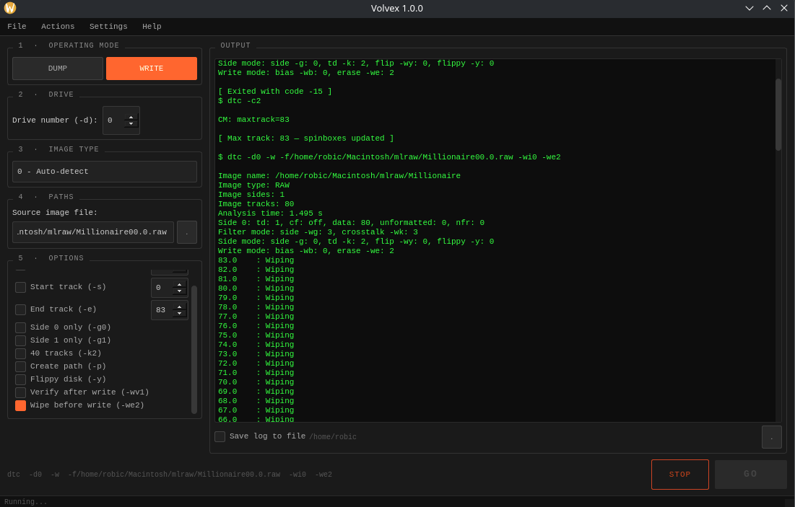

<table>
  <tr>
    <td width="200">
      
    </td>
    <td>
      <h1>Volvex</h1>
      
      
      
      
    </td>
  </tr>
</table>

---

**Volvex** is a PySide6 GUI frontend for [KryoFlux](https://www.kryoflux.com/) `dtc` and [Mimage](https://github.com/Rob1c/Mimage).  
It provides a simple, procedural and intuitive interface for dumping and writing floppy disk images without touching the command line, while still being able to watch it in real time.



## Features

- Dump & Write modes — full support for all dtc image types (KryoFlux stream, MFM, FM, AmigaDOS, Apple GCR, CBM GCR, DEC and more)
- Track and side control — configurable start/end track, single-side selection, 40-track and flippy disk support
- Auto-init — runs dtc -c2 and automatically detects and sets the max track range on the spinboxes (manual init it's also avaliable in the Actions menu)
- Live terminal output — real-time dtc and mimage output, with optional log saving to file
- Command preview — the exact command that will be executed is always visible before running
- Preset save/load — save and restore full configurations as JSON files (~/.config/volvex)
- Mimage integration — convert floppy images to stream files directly from the Actions menu
- Zenity file dialogs — native GTK file picker for paths, no manual typing required

## ⚖️ License

Volvex is released under the [CC BY-NC 4.0](https://creativecommons.org/licenses/by-nc/4.0/) license.  
Bundled `Macintosh.exe` is copyright by ZrX (KryoFlux Forums), included as custom freeware.

> **Note**: KryoFlux `dtc` is proprietary software owned by KryoFlux Products & Services Ltd / SPS.  
> Volvex does not include, modify, or redistribute `dtc`.

## 📦 Package Details

- **Latest Version**: `1.0.0`
- **Architecture**: `x86_64 (amd64)`
- **Dependencies**: `python3`, `python3-pyside6`, `zenity`, `wine`, `libgtk-3-0`
- **Recommends**: `dtc` (install separately from [kryoflux.com](https://www.kryoflux.com/))
- **Bundled**: `mimage` (latest release, fetched automatically at build time)

## Installation

## Debian Based Systems
You can install Volvex in two different ways:
1. Via repo:

### Add the repository
```bash
curl -s https://Rob1c.github.io/apt-repo/volvex-key.asc | sudo gpg --dearmor -o /usr/share/keyrings/volvex.gpg
echo "deb [signed-by=/usr/share/keyrings/volvex.gpg] https://Rob1c.github.io/apt-repo stable main" | sudo tee /etc/apt/sources.list.d/volvex.list
sudo apt update
sudo apt install volvex
```

2. Otherwise, you can install it via the .deb package (CI/CD generated).
You can use apt (**recommended**, resolves dependencies automatically):

```bash
sudo apt install ./volvex_[version]_amd64.deb
```
Or via dpkg:

```bash
sudo dpkg -i ./volvex_[version]_amd64.deb
```

Then launch from your application menu or run:

```bash
volvex
```

### dtc

`dtc` must be installed separately. Download it from the [official KryoFlux website](https://www.kryoflux.com/?page=download) and follow their instructions.

## Compatibility

Developed and tested on `Debian 13 "Trixie" (Stable)`.  
Should work on any Debian-based distribution with the listed dependencies.

## Feedback & Contributions

You're totally free to open an issue in this repository for bugs or suggestions. You can also mail me at roberto.chichiarell@gmail.com

© 2026 Roberto Chichiarelli
